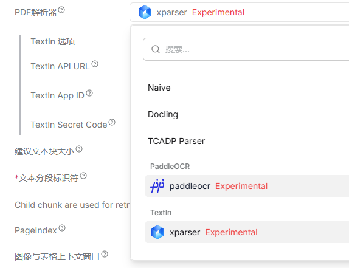

# TextIn 文档解析集成 for RAGFlow

<div align="center">

**当前基于 [RAGFlow v0.24.0](https://github.com/infiniflow/ragflow/tree/v0.24.0) | 插件式集成 **

</div>

---

## 📑 目录

- [项目简介](#-项目简介)
- [核心特性](#-核心特性)
- [快速开始](#-快速开始)
  - [前置条件](#-前置条件)
  - [国内镜像加速](#-国内镜像加速)
  - [安装步骤](#-安装步骤)
- [使用指南](#-使用指南)
  - [配置 TextIn 解析引擎](#1-配置-textin-解析引擎)
  - [在知识库中使用](#2-在知识库中使用)
  - [解析 PDF 文档](#3-解析-pdf-文档)
- [架构说明](#-架构说明)
- [常见问题](#-常见问题)
- [文档解析模型评测](#-文档解析模型评测)
- [进阶内容](#-进阶内容)
- [相关链接](#-相关链接)

---

## 📝 项目简介

本项目是 RAGFlow 的**增强版本**，集成了 [TextIn](https://www.textin.com/) 文档智能解析能力，提供更高质量的 PDF 文档理解。

**TextIn** 是合合信息旗下的文档智能处理云平台，通过 AI 能力实现文本、表格、图表和公式的精准提取。


### 设计理念

✅ **插件式集成** — 新增功能独立存放，不破坏 RAGFlow 原有代码结构

✅ **最小侵入** — 对原有文件的修改仅限于必要的路由接入

✅ **易于维护** — 便于持续跟进 RAGFlow 上游版本更新

✅ **灵活切换** — 可随时切换回官方版本或使用其他解析引擎

---

## ✨ 核心特性

| 特性 | 说明 |
|------|------|
| 🎯 **高精度解析** | 基于 TextIn 云端 AI 能力，提升复杂文档的解析准确度 |
| 📊 **智能表格识别** | 支持复杂表格结构、跨页表格的准确提取 |
| 🖼️ **图表提取** | 自动识别并裁切文档中的图表、图像内容 |
| 🔢 **公式支持** | 准确识别和提取数学公式 |
| 🌐 **云端处理** | 无需本地 GPU，通过 API 调用实现高性能解析 |
| 🔌 **知识库级配置** | 不同知识库可选择不同解析引擎，互不影响 |

---

## 🚀 快速开始

### ✅ 前置条件

在开始之前，请确保：

1. ✅ 已注册 [TextIn](https://www.textin.com/) 账号并开通 API 权限
2. ✅ 从 [TextIn 控制台](https://www.textin.com/console/dashboard/setting) 获取 **App ID** 和 **Secret Code**
3. ✅ 本地已安装 RAGflow 对应官方版本

> ⚠️ **版本提示**：请确保部署的服务镜像版本与本仓库当前 Tag 保持一致，避免版本不兼容问题。

---

### 🇨🇳 国内镜像加速

国内用户可以使用以下阿里云镜像加速部署，提升拉取速度：

| 服务 | 官方镜像 | 国内镜像 |
|------|---------|---------|
| **RAGFlow** | `infiniflow/ragflow:v0.24.0` | `crpi-2ix4w0sw61gwpv0x.cn-shanghai.personal.cr.aliyuncs.com/intsig_acg/ragflow:v0.24.0` <br/>⚠️ **基于本仓库代码构建** |
| **MySQL** | `mysql:8.0.39` | `crpi-2ix4w0sw61gwpv0x.cn-shanghai.personal.cr.aliyuncs.com/intsig_acg/mysql:8.0.39` |
| **Elasticsearch** | `elasticsearch:8.11.3` | `crpi-2ix4w0sw61gwpv0x.cn-shanghai.personal.cr.aliyuncs.com/intsig_acg/elasticsearch:8.11.3` |
| **MinIO** | `quay.io/minio/minio:RELEASE.2025-06-13T11-33-47Z` | `crpi-2ix4w0sw61gwpv0x.cn-shanghai.personal.cr.aliyuncs.com/intsig_acg/minio:RELEASE.2025-06-13T11-33-47Z` |
| **Valkey** | `valkey/valkey:8` | `crpi-2ix4w0sw61gwpv0x.cn-shanghai.personal.cr.aliyuncs.com/intsig_acg/valkey:8` |

#### ⚙️ 配置方法

使用国内镜像需要修改以下文件：

**📄 步骤 1：修改 `docker/.env` 文件**（RAGFlow 主服务镜像）

```bash
# 将第 157 行修改为：
RAGFLOW_IMAGE=crpi-2ix4w0sw61gwpv0x.cn-shanghai.personal.cr.aliyuncs.com/intsig_acg/ragflow:v0.24.0
```

**📄 步骤 2：修改 `docker/docker-compose-base.yml` 文件**（依赖服务镜像）

```yaml
# 第 5 行 - Elasticsearch
image: crpi-2ix4w0sw61gwpv0x.cn-shanghai.personal.cr.aliyuncs.com/intsig_acg/elasticsearch:8.11.3

# 第 178 行 - MySQL
image: crpi-2ix4w0sw61gwpv0x.cn-shanghai.personal.cr.aliyuncs.com/intsig_acg/mysql:8.0.39

# 第 205 行 - MinIO
image: crpi-2ix4w0sw61gwpv0x.cn-shanghai.personal.cr.aliyuncs.com/intsig_acg/minio:RELEASE.2025-06-13T11-33-47Z

# 第 227 行 - Valkey
image: crpi-2ix4w0sw61gwpv0x.cn-shanghai.personal.cr.aliyuncs.com/intsig_acg/valkey:8
```

---

### 📦 安装步骤

💡 根据实际需求选择以下两种部署方式之一：

#### 🎯 方式一：使用国内镜像（推荐）

✨ 适用于快速部署和生产环境。

按照上述 [国内镜像加速](#-国内镜像加速) 章节修改 `docker/.env` 和 `docker/docker-compose-base.yml` 文件中的镜像地址。

#### 🔧 方式二：从源码构建

🛠️ 适用于需要修改代码或调试的场景。

**📥 步骤 1：克隆仓库并构建镜像**

```bash
git clone <repository-url>
cd ragflow
docker build -t your-image-name:tag -f Dockerfile .
```

**⚙️ 步骤 2：配置镜像名称**

修改 `docker/.env` 文件第 157 行：

```bash
RAGFLOW_IMAGE=your-image-name:tag
```

---

#### 🚀 启动与访问

✅ 完成上述配置后，执行以下命令启动服务：

```bash
cd docker
DEVICE=gpu docker-compose up -d
```

🌐 **访问界面**

服务启动完成后，在浏览器中访问以下地址：

```
http://localhost:{SVR_WEB_HTTP_PORT}
```

> 💡 默认端口为 80，可在 `docker/.env` 中通过 `SVR_WEB_HTTP_PORT` 配置。

---

## 📘 使用指南

### 1. 配置 TextIn 解析引擎

#### 步骤 1.1：进入模型提供商设置

登录 RAGFlow 后，点击右上角头像，进入 **用户设置 → 模型提供商**。

#### 步骤 1.2：添加 TextIn 模型

找到 **TextIn** 卡片，点击 **添加模型**，填写以下配置信息：

| 配置项 | 说明 | 示例 |
|--------|------|------|
| 模型名称 | 自定义名称，用于识别 | `xparser` 或 `textin-primary` |
| TextIn API URL | API 端点地址（默认已填写） | `https://api.textin.com/...` |
| App ID | 从 TextIn 控制台获取 | `your_app_id` |
| Secret Code | 从 TextIn 控制台获取 | `your_secret_code` |


#### 步骤 1.3：验证并保存

点击 **验证** 按钮测试连接，验证通过后点击 **添加** 保存配置。

---

### 2. 在知识库中使用

#### 步骤 2.1：创建或打开知识库

在 RAGFlow 主界面创建新知识库，或打开已有知识库。

#### 步骤 2.2：选择 TextIn 解析器

进入知识库的 **设置** 页面，找到 **PDF 解析器** 选项。

在下拉列表的 **TextIn** 分组中，选择刚才添加的模型（标注为 *Experimental*）。



点击 **保存** 应用配置。

---

### 3. 解析 PDF 文档

#### 步骤 3.1：上传文档

在知识库中点击 **上传文件**，选择需要解析的 PDF 文档。

#### 步骤 3.2：开始解析

上传完成后，RAGFlow 将自动使用 TextIn API 进行解析。

#### 步骤 3.3：查看结果

解析完成后，可在文档详情页查看提取的文本、表格和图像内容。


---

## 🏗️ 架构说明

### 数据流程图

```
┌─────────────┐
│  PDF 文件   │
└──────┬──────┘
       │
       ▼
┌─────────────────────────────┐
│  naive.py: by_textin()      │  ← 文档处理入口
└──────┬──────────────────────┘
       │
       ▼
┌─────────────────────────────┐
│  LLMBundle (OCR 类型)        │  ← 知识库配置的 TextIn 模型
└──────┬──────────────────────┘
       │
       ▼
┌─────────────────────────────┐
│  TextInOcrModel             │  ← rag/llm/ocr_model.py
└──────┬──────────────────────┘
       │
       ▼
┌─────────────────────────────┐
│  TextInParser               │  ← deepdoc/parser/textin_parser.py
│  ├─ 调用 TextIn API          │
│  └─ 使用 pdfplumber 渲染页面 │
└──────┬──────────────────────┘
       │
       ▼
┌─────────────────────────────┐
│  (sections, tables, images) │  ← 与 RAGFlowPdfParser 兼容的输出
└─────────────────────────────┘
       │
       ▼
┌─────────────────────────────┐
│  Chunking 流水线            │  ← 无需任何改动
└─────────────────────────────┘
```

**关键设计**：`TextInParser` 继承自 `RAGFlowPdfParser`，输出格式完全兼容，下游的 Chunking、索引流程无需任何调整。

---

### 代码改动概览

<details>
<summary><b>后端改动文件</b>（点击展开）</summary>

| 文件路径 | 变更类型 | 说明 |
|---------|---------|------|
| `deepdoc/parser/textin_parser.py` | **新增** | TextIn 核心解析器实现 |
| `rag/llm/ocr_model.py` | 修改 | 新增 `TextInOcrModel` 类 |
| `rag/app/naive.py` | 修改 | 新增 `by_textin()` 处理函数 |
| `rag/app/{book,laws,manual,one,presentation}.py` | 修改 | 接入 TextIn 解析路由 |
| `common/constants.py` | 修改 | 新增 TextIn 配置常量 |
| `common/parser_config_utils.py` | 修改 | 新增 `@textin` 识别器路由 |
| `conf/llm_factories.json` | 修改 | 注册 TextIn 模型提供商 |
| `api/db/services/tenant_llm_service.py` | 修改 | 环境变量自动注入逻辑 |
| `api/apps/llm_app.py` | 修改 | TextIn API 处理 |

</details>

<details>
<summary><b>前端改动文件</b>（点击展开）</summary>

| 文件路径 | 变更类型 | 说明 |
|---------|---------|------|
| `web/src/.../modal/textin-modal/` | **新增** | TextIn 配置弹窗组件 |
| `web/src/.../setting-model/hooks.tsx` | 修改 | 新增 `useSubmitTextIn` Hook |
| `web/src/.../setting-model/index.tsx` | 修改 | 集成 TextIn 弹窗 |
| `web/src/constants/llm.ts` | 修改 | 新增 TextIn 工厂常量 |
| `web/src/assets/svg/llm/textin.svg` | **新增** | TextIn Logo 图标 |
| `web/src/locales/*.ts` | 修改 | 多语言文案支持 |

</details>


---

## ❓ 常见问题

<details>
<summary><b>Q：TextIn 会影响嵌入模型或检索流程吗？</b></summary>

不会。TextIn 仅负责 PDF 文档的解析阶段（OCR + 布局分析），后续的向量嵌入、文本分块（Chunking）、检索等流程完全不受影响。

</details>

<details>
<summary><b>Q：需要本地 GPU 资源吗？</b></summary>

不需要。TextIn 解析完全通过云端 API 调用实现，本地不会加载任何 OCR 或布局识别模型，对硬件无特殊要求。

</details>

<details>
<summary><b>Q：支持 Word、Excel 等其他文件格式吗？</b></summary>

目前仅支持 PDF 格式。本集成以插件方式接入，只在知识库配置 TextIn 引擎时对 PDF 生效，Word、Excel 等文件类型仍使用 RAGFlow 原有的解析器，行为不受影响。

</details>

<details>
<summary><b>Q：能同时使用 TextIn 和 DeepDOC 解析器吗？</b></summary>

可以。PDF 解析器在知识库级别独立配置，不同知识库可以选择不同的解析引擎（TextIn、DeepDOC 等），互不干扰。

</details>

<details>
<summary><b>Q：TextIn API 调用失败会怎样？有降级机制吗？</b></summary>

目前没有自动降级机制。如果 TextIn API 调用失败，解析任务会报错终止。建议在使用前先通过模型验证功能测试 API 连接。

</details>

<details>
<summary><b>Q：如何查看 TextIn API 的调用费用？</b></summary>

TextIn 是按调用次数或页数计费的服务，具体费用请登录 [TextIn 控制台](https://www.textin.com/console/dashboard) 查看账户余额和计费明细。

</details>

<details>
<summary><b>Q：解析速度如何？比本地 DeepDOC 快吗？</b></summary>

解析速度取决于文档复杂度和网络状况。TextIn 通过云端 GPU 集群处理，对于复杂文档通常比本地单 GPU 更快，但需要考虑网络延迟和 API 队列时间。

</details>

---

## 📊 文档解析模型评测

本项目提供了完整的评测工具，通过 RAGFlow 问答质量对比来评估不同文档解析器（TextIn、DeepDOC、PaddlePaddle 等）的实际效果。

完整的工具使用指南、配置方法和示例，请查看：

**📘 [`test_qa/README.md`](test_qa/README.md)**

---

## 🔬 进阶内容

### 解析行为说明

<details>
<summary><b>内容类型映射</b></summary>

TextIn API 返回结构化的 `detail` 数组，解析器按以下规则处理不同类型的内容：

| `type` | `sub_type` | RAGFlow 处理方式 |
|--------|------------|-----------------|
| `paragraph` | `text` / `text_title` / `header` / `footer` / `sidebar` / `image_title` / `catalog` | 作为文本块添加到 `self.boxes`，参与后续 Chunking |
| `paragraph` | `table_title` | 与最近的表格关联，嵌入 HTML `<caption>` 标签 |
| `table` | — | 转换为 HTML 表格，添加到 `tbls` 列表 |
| `image` | `chart` / `figure` 等 | 从 PDF 页面裁切图像，添加到 `images` 列表 |

</details>

<details>
<summary><b>跨页表格处理</b></summary>

TextIn 通过 `split_section_page_ids` 和 `split_section_positions` 字段标记跨页拆分的表格。

解析器会为每个分段生成独立的 position 记录，确保在 RAGFlow UI 中能够正确高亮显示表格的所有分段。

</details>

<details>
<summary><b>坐标系统转换</b></summary>

TextIn API 使用 144 DPI 坐标系统，而 RAGFlow 使用 72 DPI。解析器会自动进行坐标转换：

```python
ragflow_coord = textin_coord / 2.0
```

这确保了文档高亮位置的准确性。

</details>

---

### 开发者指南

#### 类继承关系

```
RAGFlowPdfParser (基类)
    │
    └── TextInParser              ← deepdoc/parser/textin_parser.py
            │
            └── TextInOcrModel    ← rag/llm/ocr_model.py
```

#### 本地开发

如需修改 TextIn 集成代码，建议按以下步骤进行本地开发：

```bash
# 1. 克隆仓库
git clone <repository-url>
cd ragflow

# 2. 安装依赖
uv sync --python 3.12 --all-extras

# 3. 启动基础服务
docker compose -f docker/docker-compose-base.yml up -d

# 4. 配置环境变量
cp docker/.env.example docker/.env
# 编辑 docker/.env，添加 TextIn 配置

# 5. 启动后端服务
source .venv/bin/activate
export PYTHONPATH=$(pwd)
bash docker/launch_backend_service.sh

# 6. 修改代码并测试
# 修改 deepdoc/parser/textin_parser.py 等文件
# 重启服务验证效果
```

---

## 🔗 相关链接

### 官方资源

- **RAGFlow 官方仓库**：[github.com/infiniflow/ragflow](https://github.com/infiniflow/ragflow)
- **RAGFlow 文档**：[ragflow.io/docs](https://ragflow.io/docs)
- **TextIn 官网**：[www.textin.com](https://www.textin.com/)
- **TextIn API 文档**：[docs.textin.com/xparse/parse-quickstart](https://docs.textin.com/xparse/parse-quickstart)

### 社区与支持

- **问题反馈**：[提交 Issue](../../issues)
- **功能建议**：[创建 Discussion](../../discussions)

---

## 📄 许可证

本项目遵循 **Apache 2.0 License**，与 RAGFlow 保持一致。详见 [LICENSE](LICENSE) 文件。

---

## 🙏 致谢

衷心感谢以下团队与项目：

- **[RAGFlow](https://github.com/infiniflow/ragflow)** 团队 — 构建了优秀的开源 RAG 引擎，提供了良好的架构设计与扩展性
- **[TextIn](https://www.textin.com/)** (合合信息) — 提供了强大的文档智能解析能力
- 所有为本项目提供反馈和贡献的开发者

---

<div align="center">

**⭐ 如果这个项目对你有帮助，欢迎 Star 支持！**

Made with ❤️ by RAGFlow & TextIn Community

</div>

